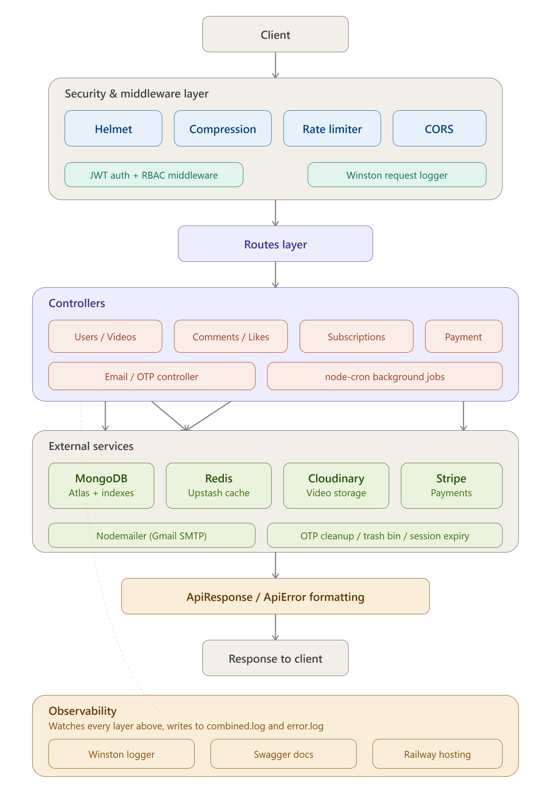

# 100 Days of Backend Development

A complete backend learning journey — from Node.js fundamentals to a fully deployed, production-ready REST API. Each folder represents one stage of progressive learning, building toward the final VideoApp Backend project.

## Final Project

The complete, deployed application lives in a separate repository:

**Live API:** https://videoapp-backend-production-a823.up.railway.app/api/v1
**API Docs:** https://videoapp-backend-production-a823.up.railway.app/api-docs
**Repository:** https://github.com/Eman-Nazir/videoapp-backend

## Final Architecture

Every request flows through security middleware, JWT authentication, and role-based access control before reaching the controller layer. Controllers connect to MongoDB, Redis, Cloudinary, and Stripe, with Winston logging every action across the entire stack.

## Folder-by-Folder Breakdown

| Folder | Focus |
|--------|-------|
| Day-1 | Node.js & Express fundamentals |
| Day-2-Frontend-backend-demo | Connecting frontend and backend basics |
| Day-3-DataModelling | Mongoose schemas and models |
| Day-4 | Professional backend project structure |
| Day-5-ErrorHandeling | Centralized error handling & API responses |
| Day-6-FileUpload_Controller | Multer + Cloudinary file uploads |
| Day-7-Register_Controller | User registration with validation |
| Day-8-Access_Refresh_Token | JWT access/refresh tokens, subscriptions model |
| Day-9-Update_User_Controller | Profile management, avatar/cover updates |
| Day-10-Mongodb_aggregation_pipelines | MongoDB aggregation pipelines |
| Day-11-Video-API | Full video CRUD with publish toggle |
| Day-12-RateLimiting_HelmetJS | Helmet security headers, rate limiting |
| Day-13-RBAC | Role-based access control, comment system |
| Day-14-Pagination-Search-Filter | Pagination, sorting, keyword search |
| Day-15-LikeSystem-SubscriptionSystem | Like/unlike and subscription toggle logic |
| Day-16-EmailNotifications-OTPVerification | Nodemailer, OTP verification, password reset |
| Day-17-BackgroundJobs-TaskScheduling | node-cron automated cleanup jobs |
| Day-18-Stripe-Payment-Integration | Stripe checkout sessions |
| Day-19-Caching-with-Redis | Redis caching via Upstash |
| Day-20-API-Optimization | Compression, indexing, query optimization |
| Day-21-Complete-Jest-Testing-Setup | Unit and integration testing (78 tests) |
| Day-22-Deployment-to-Render | Live deployment to Railway |
| Day-23-Swagger-API-Documentation | Interactive OpenAPI documentation |
| Day-24-Winston-Logger | Structured production logging |

## Tech Stack

Node.js, Express.js, MongoDB, Mongoose, Redis (Upstash), Cloudinary, JWT, bcrypt, Stripe, Nodemailer, node-cron, Winston, Swagger, Jest, Supertest, Helmet, Railway

## How to Navigate This Repo

Each `Day-XX-*` folder is a snapshot of the project at that stage of learning. Later folders build on earlier ones. Day-24-Winston-Logger contains the most complete version, mirroring the deployed `videoapp-backend` repository.

## Author

**Eman Nazir**
BS Computer Science, University of Agriculture, Faisalabad
MERN Stack Developer Trainee at ZACoders

Documented publicly as part of a 100 Days of Web Development challenge on LinkedIn.
